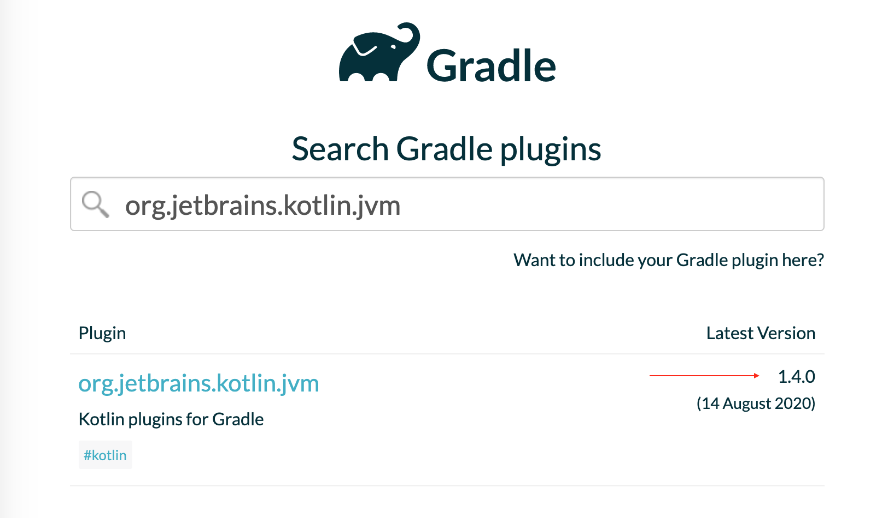

# Домашнее задание к занятию «1.1. Рабочее окружение: Gradle, Plugins, IntelliJ IDEA»

В качестве результата пришлите ссылки на ваши GitHub-проекты в личном кабинете студента на сайте [netology.ru](https://netology.ru).

**Важно**: ознакомьтесь со ссылками на главной странице [репозитория с домашними заданиями](../README.md).

Если у вас что-то не получилось, то оформляйте Issue [по установленным правилам](../report-requirements.md).

## Как сдавать задачи

1. Создайте на вашем компьютере Gradle-проект.
1. Инициализируйте в нём пустой Git-репозиторий.
1. Добавьте в него готовый файл [.gitignore](../.gitignore).
1. Добавьте в этот же каталог остальные необходимые файлы.
1. Сделайте необходимые коммиты.
1. Создайте публичный репозиторий на GitHub и свяжите свой локальный репозиторий с удалённым.
1. Сделайте пуш и удостоверьтесь, что ваш код появился на GitHub.
1. Ссылку на ваш проект отправьте из личного кабинета на сайте [netology.ru](https://netology.ru).
1. Необязательные задачи можно не сдавать — это не повлияет на получение зачёта. В этом ДЗ все задачи обязательные.

**Перед выполнением задания** убедитесь, что у вас установлены последние версии [IntelliJ IDEA Community Edition](https://github.com/netology-code/guides/tree/master/intellij_idea) (бесплатная версия) и [Android Studio](https://github.com/netology-code/guides/blob/master/android/android_studio/instruction1.md), инструкции по установке вы найдете по ссылкам. При возникновении проблем с настройкой и установкой - напишите в чат учебной группы.

## Задача №1 - First App

Ваша задача на первое занятие достаточно простая: по примеру из лекции создать проект, выводящий в консоль `First App!`.

При этом:
* groupId: ru.netology
* artifactId: first-app
* version: 1.0-SNAPSHOT

Версия плагина: последняя доступная на https://plugins.gradle.org, забиваете в поиск и смотрите:

Итог: у вас должен быть репозиторий на GitHub, в котором будет ваш Gradle-проект.
