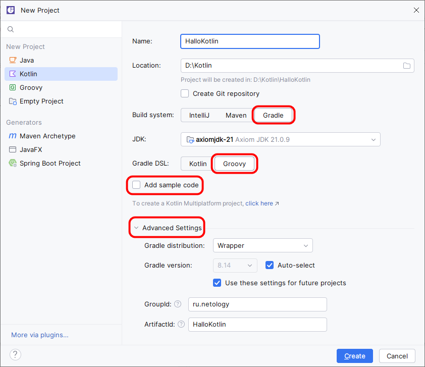
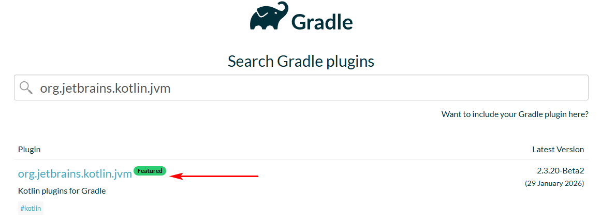
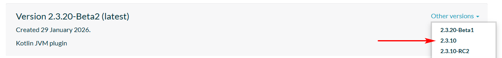

# Домашнее задание к занятию «1.1. Рабочее окружение: Gradle, Plugins, Open IDE»

В этом задании вы примерите на себя роль начинающего разработчика и научитесь создавать новый проект в Open IDE. 

**Цели задания**
·	Понять, как строится процесс разработки  программного обеспечения.
·	Научиться настраивать проект, управлять зависимостями и создавать рабочий процесс, соответствующий  потребностям.
·	Закрепить навык сборки, запуска и отправки кода в удалённый репозиторий.
·	​Научиться подключать и настраивать Kotlin‑плагин.
·	Разобраться, как создавать локальный Git‑репозиторий, делать первые коммиты и связывать его с публичным репозиторием на GitHub.

**Примерное время выполнения задания:** 45 мин.
Это задание для самостоятельной работы — оно не будет проверяться экспертом. После загрузки вашего решения вы получите эталонное решение от эксперта.

**Инструменты для выполнения задания:**
Убедитесь, что у вас установлена последняя версия Open IDE. Инструкцию по установке вы найдёте в личном кабинете в контенте занятия. Если возникнут проблемы с настройкой и установкой, напишите в чат учебной группы.

**Важно**: ознакомьтесь со ссылками на главной странице [репозитория с домашними заданиями](../README.md).

Если у вас что-то не получилось, оформите Issue. [Шаблон для оформления](../report-requirements.md).

## Задача «First App»

В этом задании вам нужно создать репозиторий на GitHub и разместить в нём свой Gradle-проект.
Требования к проекту: 
* настроен Kotlin;
* присутствует файл .gitignore из репозитория курса;
* `groupId` установлен в ru.netology, а `artifactId` в HelloKotlin;
* есть минимальный исходный код Kotlin-приложения, который при запуске выводит в консоль строку `First App!`.

Проект должен:
* успешно собираться через Gradle (команда сборки в IDE выполняется без ошибок);
* успешно запускаться (Run-конфигурация запускает программу и в консоли видно `First App!`).

## Как выполнять задание:

**1. Создайте на вашем компьютере Gradle-проект.**
- В списке типов проекта выберите Gradle‑проект с поддержкой Kotlin/JVM.
- Укажите:
   - groupId: `ru.netology`;
   - artifactId: `HelloKotlin`.
- В настройке Gradle DSL выберите значение `Groovy`.
- Укажите JDK версии выше 11. (Рекомендуется использовать Axiom JDK).

**2. Настройка версии Gradle‑плагина.**
- Откройте [сайт плагинов Gradle](https://plugins.gradle.org/) и найдите самую последнюю стабильную версию плагина `org.jetbrains.kotlin.jvm` (не `RC`, не `alpha` и не `beta`).

- В `build.gradle` в секции plugins укажите найденную версию и сохраните файл.
- Синхронизируйте проект.

**3. Добавление кода.**
- Откройте `src/main/kotlin` и создайте новый файл с расширением `.kt`.
- Напишите программу с функцией main, которая выводит в консоль `First App!`.
- Запустите программу из IDE и убедитесь, что она выполняется.

 **4. Git и .gitignore.**
- В корне проекта инициализируйте Git‑репозиторий.
- Создайте файл `.gitignore` в корне и скопируйте в него содержимое шаблона [.gitignore](https://github.com/netology-code/kt-homeworks/blob/KT-78/.gitignore).
- Добавьте файлы в индекс и сделайте первый коммит. 

**5. Публикация на GitHub и проверка.**
- Создайте публичный репозиторий на GitHub.
- Привяжите локальный репозиторий к удалённому.
- Сделайте push и удостоверьтесь, что ваш код появился на GitHub.

## Правила приёма домашнего задания
Прикрепите ссылку на ваш GitHub-проект в личном кабинете на сайте [netology.ru](https://netology.ru) и нажмите «Отправить решение».

