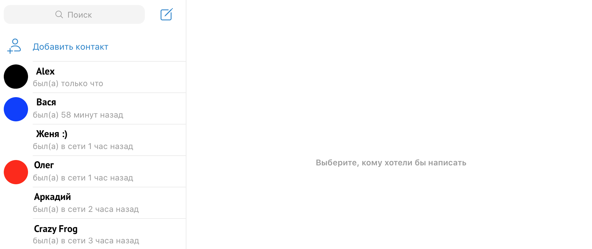

# Домашнее задание к занятию «1.3. Управляющие конструкции. Функции»

Выполненное задание прикрепите ссылкой на ваши GitHub-проекты в личном кабинете студента на сайте [netology.ru](https://netology.ru).

**Важно**: ознакомьтесь со ссылками на главной странице [репозитория с домашними заданиями](../README.md).

Если у вас что-то не получилось, оформите Issue. [Шаблон для оформления](../report-requirements.md).

Не делайте ДЗ всех занятий в одном репозитории. Потом будет сложно подключать системы Continuous Integration.

## Как сдавать задачи

1. Создайте на вашем компьютере Gradle-проект.
1. Инициализируйте в нём пустой Git-репозиторий.
1. Добавьте в него готовый файл [.gitignore](../.gitignore).
1. Добавьте в этот же каталог остальные необходимые файлы.
1. Сделайте коммиты.
1. Создайте публичный репозиторий на GitHub и свяжите свой локальный репозиторий с удалённым.
1. Сделайте пуш и удостоверьтесь, что ваш код появился на GitHub.
1. Ссылку на ваш проект прикрепите в личном кабинете на сайте [netology.ru](https://netology.ru).
1. Выполните все задания, чтобы получить зачёт по теме.

## Задача №1. Только что

Социальные сети и мессенджеры показывают, когда ваш собеседник последний раз был онлайн:

Используя `when`, напишите функцию `agoToText` (скорее всего, вам понадобится не одна функция), которая учитывает, сколько времени прошло с последнего визита пользователя, и выдаёт текст (`String`).

Нас будет интересовать вся фраза, например, `был(а) только что` или `был(а) в сети 3 часа назад`.

### Какие правила стоит учесть
1. Если количество секунд от 0 до 60, используйте вариант с `только что`.
1. Если количество секунд от 61 до 60 * 60 (один час), вариант с `x минут назад`.
1. Если количество секунд от 60 * 60 + 1 до 24 * 60 * 60 (сутки), вариант с `x часов назад`.
1. Если количество секунд от суток до двух, вариант `вчера`.
1. Если количество секунд от двух суток до трёх, вариант `позавчера`.
1. Если количество секунд больше трёх суток, вариант `давно`.

Вам понадобятся вспомогательные функции, которые умеют делать:
* 1 минут**у** назад,
* 2 минут**ы** назад,
* 5 минут назад,
* 11 минут назад,
* 21 минут**у** назад,
* 25 минут назад.

То же самое с часами: час, часа, часов.

Итог: у вас должен быть репозиторий на GitHub, в котором будет ваш Gradle-проект.

## Задача №2. Разная комиссия

В прошлый раз мы рассматривали упрощённый вариант вычисления комиссии. Давайте усложним задачу. 

За MasterCard и Maestro вообще не нужно платить, пока не превысили лимит (замечание `от 300` убираем), а для VK Pay всегда бесплатно:

Напишите алгоритм расчёта в виде функции, передавая в функцию:
* тип карты/счёта (по умолчанию VK Pay);
* сумму предыдущих переводов в этом месяце (по умолчанию 0 рублей);
* сумму совершаемого перевода.

Итог: у вас должен быть репозиторий на GitHub, в котором будет ваш Gradle-проект.
