# Домашнее задание к занятию «2.1. Функции, автотесты и Continuous Integration»

В качестве результата пришлите ссылки на ваши GitHub-проекты в личном кабинете студента на сайте [netology.ru](https://netology.ru).

**Важно**: ознакомьтесь со ссылками, представленными на главной странице [репозитория с домашними заданиями](../README.md).

**Важно**: если у вас что-то не получилось, то оформляйте Issue [по установленным правилам](../report-requirements.md).

**Важно**: не делайте ДЗ всех занятий в одном репозитории! Иначе вам потом придётся достаточно сложно подключать системы Continuous Integration.

## Как сдавать задачи

1. Создайте на вашем компьютере Gradle-проект
1. Инициализируйте в нём пустой Git-репозиторий
1. Добавьте в него готовый файл [.gitignore](../.gitignore)
1. Добавьте в этот же каталог остальные необходимые файлы
1. Сделайте необходимые коммиты
1. Создайте публичный репозиторий на GitHub и свяжите свой локальный репозиторий с удалённым
1. Сделайте пуш (удостоверьтесь, что ваш код появился на GitHub)
1. Ссылку на ваш проект отправьте в личном кабинете на сайте [netology.ru](https://netology.ru)
1. Задачи, отмеченные, как необязательные, можно не сдавать, это не повлияет на получение зачета (в этом ДЗ все задачи являются обязательными)

## Задача №1 - Максимальное покрытие

Вам нужно взять уже полюбившуюся вам функцию расчёта комиссии при переводе и написать для неё автотесты:


Подключите JUnit4 и JaCoCo и добейтесь того, чтобы покрытие кода по branch'ам было не менее 80%:

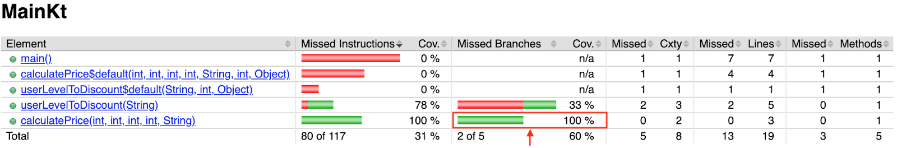

Информацию о том, что значит по branch'ам вы найдёте на [официальном сайте JaCoCo](https://www.eclemma.org/jacoco/trunk/doc/counters.html).

Итого: у вас должен быть репозиторий на GitHub, в котором расположен ваш Gradle-проект (автотесты также должны храниться в репозитории).

## Задача №2 - CI

Запускать тесты на своём компьютере - хорошо, а запускать их при каждом пуше в облаке – ещё лучше. Когда вы будете работать в команде, сразу будет видно, кто "сломал" сборку, а кто прислал "нерабочий PR (Pull-Request)". В этом вся прелесь командной работы 😈!

Мы настроим CI на базе GitHub Actions - уже встроенной в GitHub системы.

После того, как вы сделали задачу №1, перейдите в ваш репозиторий на вкладку GitHub Actions:

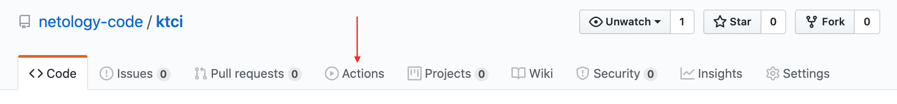

GitHub Actions предложить вам настроить Simple Workflow, соглашаемся:

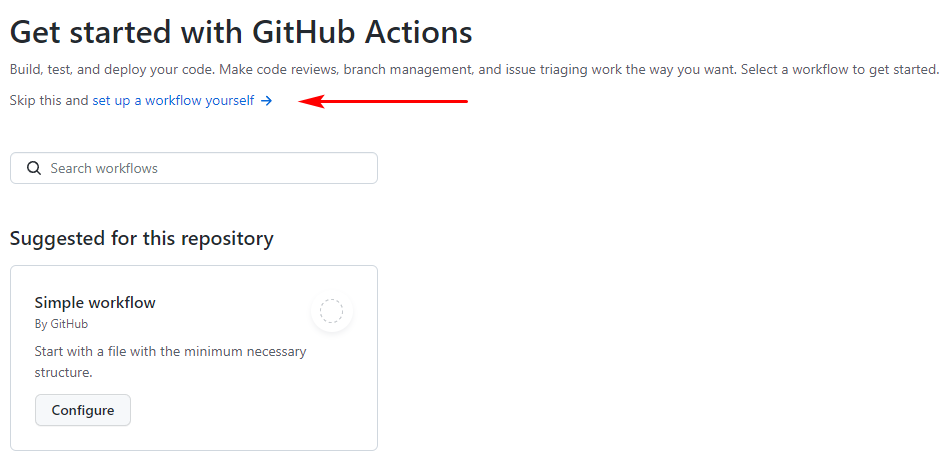

В открывшемся окне делаем по шагам:
1. Меняем имя файла на `gradle.yml`
1. Меняем весь код, на тот что ниже
1. Нажимаем "Start Commit" 
1. Нажимаем "Commit new file" 

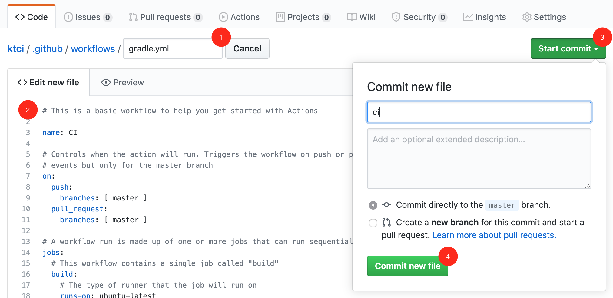
 
Код для `gradle.yml` (скопируйте и замените целиком - не переписывайте вручную):

```yml
name: Kotlin CI with Gradle

on:
  push:
    branches: [ master ]
  pull_request:
    branches: [ master ]

jobs:
  build:

    runs-on: ubuntu-latest

    steps:
    - uses: actions/checkout@v2
    - name: Set up JDK 1.8
      uses: actions/setup-java@v1
      with:
        java-version: 1.8
    - name: Grant execute permission for gradlew
      run: chmod +x gradlew
    - name: Build with Gradle
      run: ./gradlew build --info

```

"Everything as code" и "Configuration as code" - большинство современных CI систем следуют этому подходу, когда все необходимые настройки хранятся в текстовом файле в самом репозитории. В случае GitHub Actions в вашем репозитории создастся файл `./github/workflows/gradle.yml`, поэтому не забудьте сделать `git pull`, чтобы он попал и в ваш локальный репозиторий.

Если вы скопируете конфигурацию неправильно, GitHub Actions сообщит вам об этом (мы удалили у первого слова первую букву):

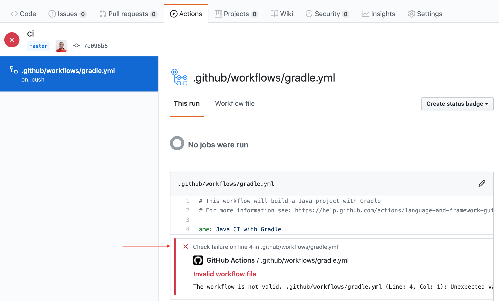

После того, как вы закоммитите корректный файл конфигурации, на вкладке GitHub Actions можно посмотреть прогресс выполнения:

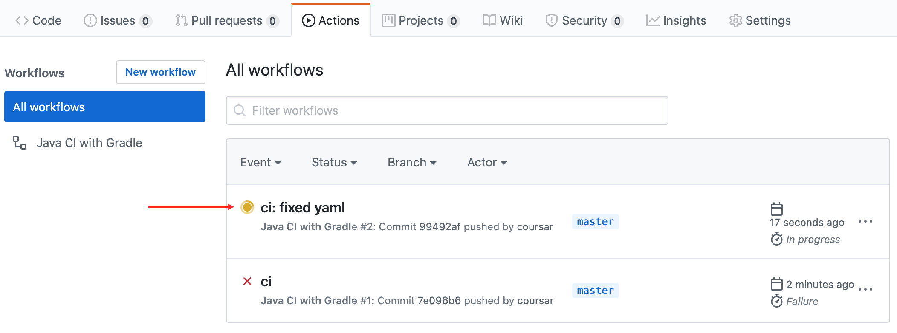

Через какое-то время получим общий итог: PASS (зелёный флажок) или FAIL (красный крестик):

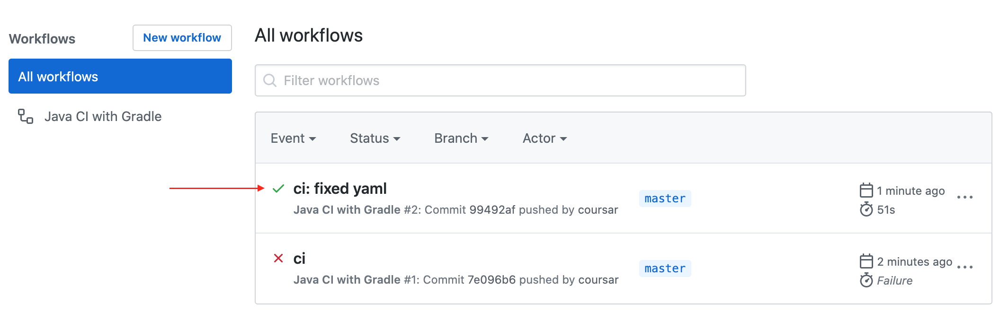

Для каждого коммита, для которого производилась сборка, на всех страницах GitHub будет отображаться статус (иконки статуса кликабельны):

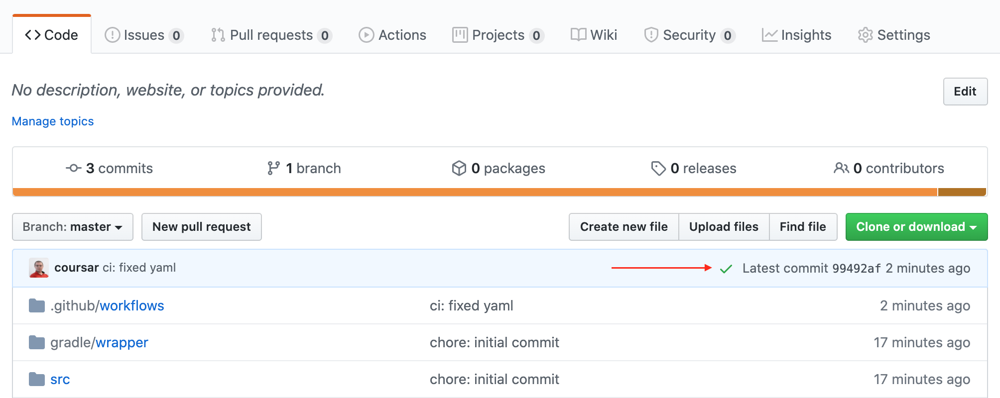

Можно "провалиться" внутрь, чтобы посмотреть логи сборки:

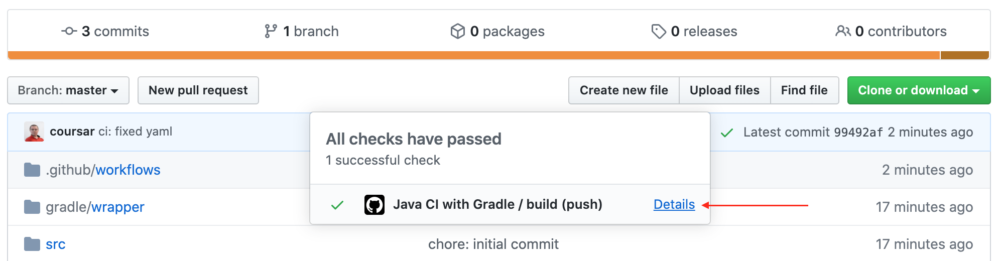

И раскрыть интересующий нас раздел:

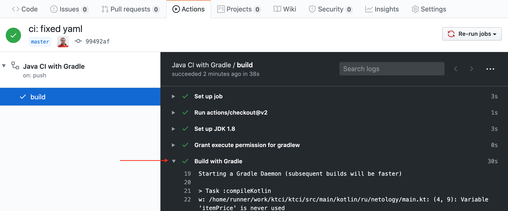

Если мы специально или случайно уроним сборку, то это тоже будет видно:

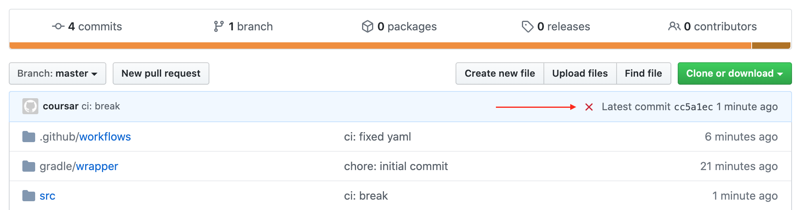

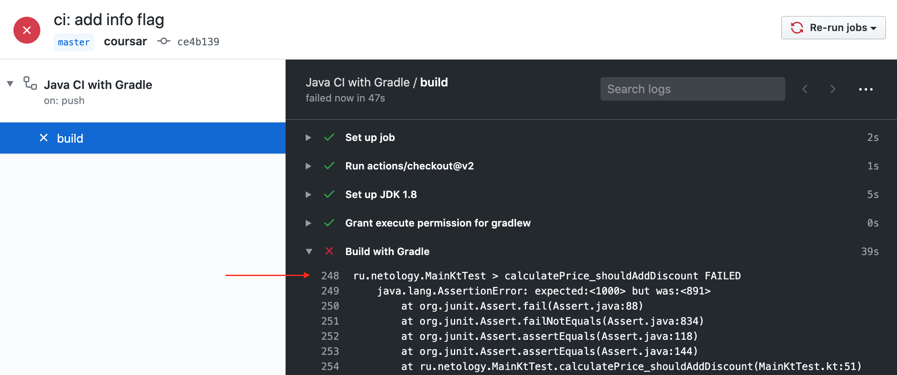

Полностью настроенный CI на основе примеров с лекции вы можете найти по адресу: https://github.com/netology-code/ktci.

### Задача

Соответственно, ваша задача - подключить к вашему репозиторию GitHub Actions, следуя пошаговой инструкции, которая была приведена выше.

Чтобы удостовериться, что CI действительно работает - добавьте (как мы в примере) коммит, ломающий сборку (выставьте в тестах неправильное ожидаемое значение). Убедитесь, что после Push'а вам покажут эту проблему.

**Важно**: вам не нужно каждый раз создавать заново файл конфигурации GitHub Actions, достаточно добавлять его в новый репозиторий так же, как вы это делаете с `.gitignore`.

Итого, у вас должно быть:
1. У вас должен быть репозиторий на GitHub, в котором расположен ваш Gradle-проект
1. К репозиторию должен быть подключен GitHub Actions
1. В истории должен быть хотя бы один коммит, ломающий сборку

