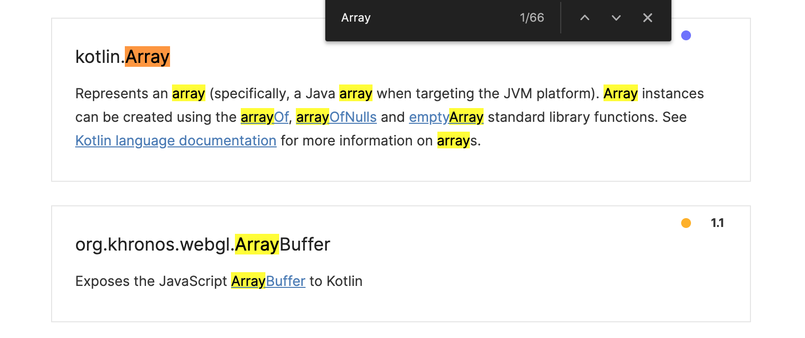
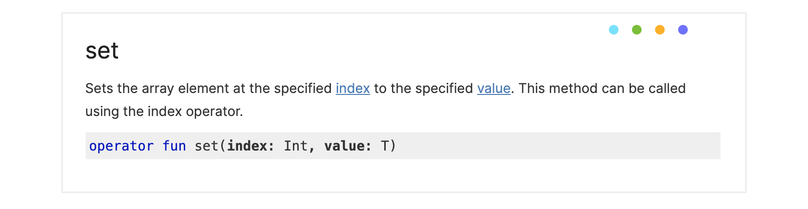
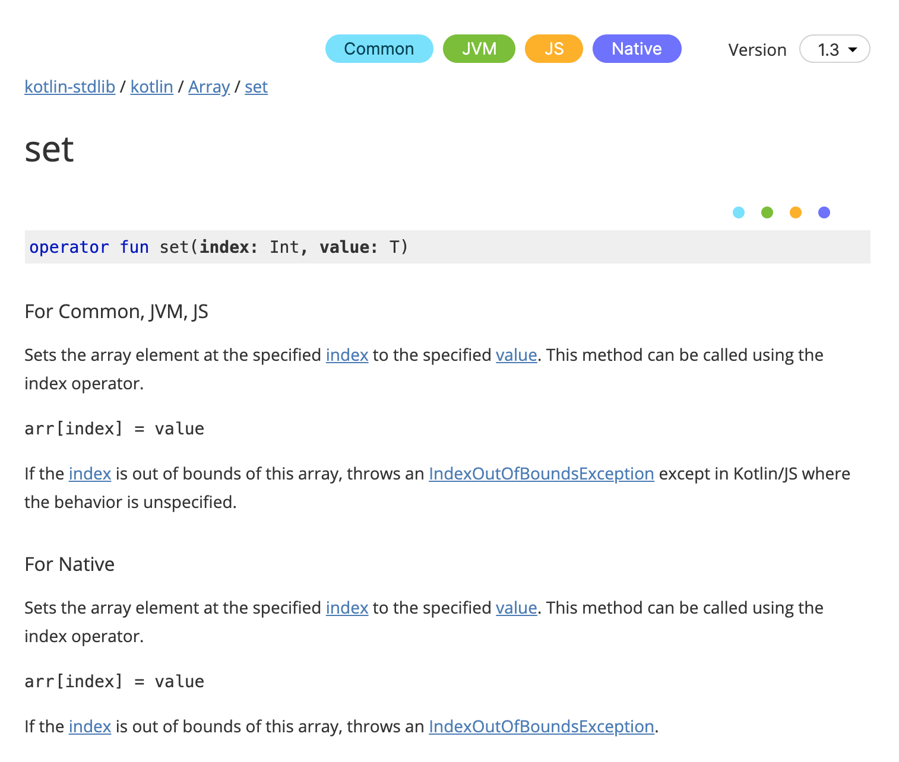

# Домашнее задание к занятию «2.2. ООП: объекты и классы»

Выполненное задание прикрепите ссылкой на ваши GitHub-проекты в личном кабинете студента на сайте [netology.ru](https://netology.ru).

**Важно**: ознакомьтесь со ссылками на главной странице [репозитория с домашними заданиями](../README.md).

Если у вас что-то не получилось, оформите Issue. [Шаблон для оформления по ссылке](../report-requirements.md).

Нужно сделать все задачи в **одном** репозитории.

## Как сдавать задачи

1. Создайте на вашем компьютере Gradle-проект.
1. Инициализируйте в нём пустой Git-репозиторий.
1. Добавьте в него готовый файл [.gitignore](../.gitignore).
1. Добавьте в этот же каталог остальные необходимые файлы.
1. Сделайте коммиты.
1. Создайте публичный репозиторий на GitHub и свяжите свой локальный репозиторий с удалённым.
1. Сделайте пуш и удостоверьтесь, что ваш код появился на GitHub.
1. Ссылку на ваш проект прикрепите в личном кабинете на сайте [netology.ru](https://netology.ru).
1. Выполните все задания, чтобы получить зачёт по теме.

## Задача №1. Посты

На этом этапе мы будем не только решать вычислительные задачи, но и моделировать системы.

На лекции мы разобрали упрощённый пример того, как может выглядеть пост. Давайте посмотрим на более сложные примеры. Кстати, хорошая практика: анализировать системы, с которыми вы работаете в жизни, и продумывать, как бы сделали вы.

В качестве примера возьмём ВКонтакте: https://vk.com/dev/objects/post. Если страница недоступна, воспользуйтесь [копией](assets/post.pdf) из каталога [assets](assets)).

### На что нужно обратить внимание
1. В Kotlin используется `camelCase` для полей.
1. Некоторые поля помечены как `integer [0, 1]`, хотя по логике должны быть `Boolean` (у вас должны быть `Boolean`).
1. Добавьте из перечисленных в документации около 10 полей простых типов (Int, String, Boolean).
1. Поля типа `object` должны быть описаны отдельными классами. Добавьте хотя бы одно такое поле (например, `comments` или `likes`).
1. Для полей вы можете добавлять значения по умолчанию, аналогично параметрам функций. При таком подходе вам не нужно будет указывать значения всех аргументов при создании объектов класса.

Что мы хотим получить:
1. Data-класс `Post` (и другие классы, которые могут быть вложены в `Post`).
1. Объект `WallService`, который хранит посты в массиве.

## Задача №2. Wall

Теперь нужно разобраться с функциональностью сервиса, отвечающего за стены пользователей: https://vk.com/dev/wall ([копия](assets/wall.pdf)).

Нас будут интересовать следующие методы:
* создание записи;
* обновление записи.

### Создание записи

Метод для создания записи должен выглядеть вот так:
```kotlin
    fun add(post: Post): Post {
        TODO()
    }
```

Как он должен работать:
1. добавлять запись в массив, но при этом назначать посту уникальный среди всех постов идентификатор;
1. возвращать пост с уже выставленным идентификатором.

<details>
  <summary>Подсказка</summary>

  Возможно, вам стоит завести private-переменную для хранения следующего уникального `id`. Пока у нас in-memory система: всё хранится в оперативной памяти, всё работает на одной машине.
</details>

### Обновление записи

Метод для создания записи должен выглядеть так:
```kotlin
    fun update(post: Post): Boolean {
        TODO()
    }
```

Как он должен работать:
1. находить среди всех постов запись с тем же `id`, что и у `post` и обновлять все свойства;
1. если пост с таким `id` не найден, то ничего не происходит и возвращается `false`, в противном случае – возвращается `true`.

<details>
  <summary>Документация на Array</summary>

Для работы с любыми типами вам могут понадобиться методы и операторы из тех, что мы ещё не проходили.

Давайте разберёмся, где и как в таких случаях искать информацию. Искать её нужно не на StackOverflow или в статьях, а на официальном сайте.

1\. Поскольку вы знаете, что класс называется `Array`, вы идёте по адресу https://kotlinlang.org/api/latest/jvm/stdlib/alltypes/ и через Ctrl + F (либо Cmd + F в Mac) ищете `Array`:



Кликаете для перехода.

2\. На странице описания вы видите, на каких платформах доступен этот тип и как можно создавать его экземпляры:


3\. Далее будет идти описание конструкторов, свойств и функций, вы можете выбрать то, что вас интересует:



4\. Внутри с помощью «кусочков» кода будет описано, как эту функцию использовать, включая, например, использование в виде оператора `[]`:



Т.е. `set` - это и есть `[]`, который мы использовали в лекции.

Обратите внимание: в Kotlin добавлено огромное количество готовых функций и удобных способов что-то сделать минимумом кода. Поэтому прежде чем писать что-то, особенно в части работы с набором элементов, обязательно почитайте документацию. Вполне вероятно, что готовое решение уже существует.
</details>

## Задача №3. Wall Tests

Следующая задача – написать автотесты на ваши методы:
* на `add` – всего один, который проверяет, что после добавления поста `id` стал отличным от 0.
* на `update` – целых два:
    - изменяем пост с существующим `id`, возвращается `true`;
    - изменяем пост с несуществующим `id`, возвращается `false`.

Пока мы не проверяем, что `add` действительно добавил, а `update` действительно что-то меняет.

Этим мы займёмся на следующих лекциях, когда достроим систему до действительно тестируемой.

По факту речь идёт о том, что нам придётся либо дописать специальные вспомогательные методы, либо научиться работать с `nullable` значениями.

### Проблемы синглтонов

Синглтоны создаются один раз при старте приложения и в единственном экземпляре.

Тестировать такое не всегда удобно: вы либо должны сделать метод, который «вычищает» синглтон, т.е. сбрасывает массив записей, либо переделать `object` на обычный класс.

Если вы сделаете обычный класс, тогда в каждом тесте вы можете поступить следующим образом. Пример для `update`:

```kotlin
class WallServiceTest {
    @Test
    fun updateExisting() {
        // создаём целевой сервис
        val service = WallService()
        // заполняем несколькими постами
        service.add(Post(/* заполняете поля */))
        service.add(Post(/* заполняете поля */))
        service.add(Post(/* заполняете поля */))
        // создаём информацию об обновлении
        val update = Post(/* заполняете поля */)

        // выполняем целевое действие
        val result = service.update(update)

        // проверяем результат (используйте assertTrue или assertFalse)
        assertTrue(result)
    }
}
```

Если вы хотите оставить `WallService` в виде `object`, то можно добавить в него метод очистки `clear`:

```kotlin
object WallService {
    private var posts = emptyArray<Post>()

    fun clear() {
        posts = emptyArray()
    }
}
```

А затем указать JUnit с помощью аннотации `@Before`, что метод необходимо вызывать перед каждым тестом:

```kotlin
class WallServiceTest {

    @Before
    fun clearBeforeTest() {
        WallService.clear()
    }

    @Test
    fun updateExisting() {
        ...
    }
}
```

### Итог
1. У вас должен быть репозиторий на GitHub, в котором будет ваш Gradle-проект.
1. К репозиторию должен быть подключён GitHub Actions.
1. Сборка должна быть «зелёной» — ваши тесты должны проходить.
