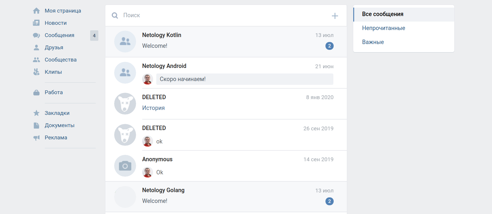

# Домашнее задание к занятию «3.3. Лямбды, extension-функции, операторы»

Выполненное задание прикрепите ссылкой на ваши GitHub-проекты в личном кабинете студента на сайте [netology.ru](https://netology.ru).

**Важно**: ознакомьтесь со ссылками на главной странице [репозитория с домашними заданиями](../README.md).

Если у вас что-то не получилось, оформите Issue [по установленным правилам](../report-requirements.md).

## Как сдавать задачи

1. Создайте на вашем компьютере Gradle-проект.
1. Инициализируйте в нём пустой Git-репозиторий.
1. Добавьте в него готовый файл [.gitignore](../.gitignore).
1. Добавьте в этот же каталог остальные необходимые файлы.
1. Сделайте необходимые коммиты.
1. Создайте публичный репозиторий на GitHub и свяжите свой локальный репозиторий с удалённым.
1. Сделайте пуш и удостоверьтесь, что ваш код появился на GitHub.
1. Ссылку на ваш проект прикрепите в личном кабинете на сайте [netology.ru](https://netology.ru).
1. Выполните все задачи, чтобы получить зачёт по теме.

## Мини-проект. ChatService

Давайте посмотрим, как настраивать личные сообщения в социальном сервисе. 

Вы можете реализовать задачу так, как сочтёте нужным. Но вот несколько требований:
1. Должны быть чаты. Чат — это общение с одним человеком, так называемые `direct messages`.
1. Можно создавать чаты, удалять их, получать список имеющихся чатов.
1. В каждом чате есть сообщения от 1 до нескольких (см. раздел ниже).
1. Можно создавать сообщения, редактировать их и удалять. Для простоты — можно удалять и свои, и чужие.
1. В каждом чате есть прочитанные и непрочитанные сообщения.

Возможности для пользователя:
1. Видеть, сколько чатов не прочитано (например, `service.getUnreadChatsCount`). В каждом из таких чатов есть хотя бы одно непрочитанное сообщение.
1. Получить список чатов (например, `service.getChats`).
2. Получить список последних сообщений из чатов (можно в виде списка строк). Если сообщений в чате нет (все были удалены), то пишется «нет сообщений».
3. Получить список сообщений из чата, указав:
    * ID собеседника;
    * количество сообщений.
После того как вызвана эта функция, все отданные сообщения автоматически считаются прочитанными.
1. Создать новое сообщение.
1. Удалить сообщение.
1. Создать чат. Чат создаётся, когда пользователю отправляется первое сообщение.
1. Удалить чат, т. е. целиком удалить всю переписку.

Старайтесь использовать lambda-функции (их напишите сами) и extension-функции (есть в составе `Iterable`, `Collection`, `List`).

Расчёт статистики старайтесь производить как цепочку вызовов lambda-функций. Попробуйте обойтись без `for`, `while` и `do-while`.

Итог: у вас должен быть репозиторий на GitHub, в котором расположен ваш Gradle-проект. Автотесты также должны храниться в репозитории.

**Важно**: автотесты должны быть, в том числе на исключения.
